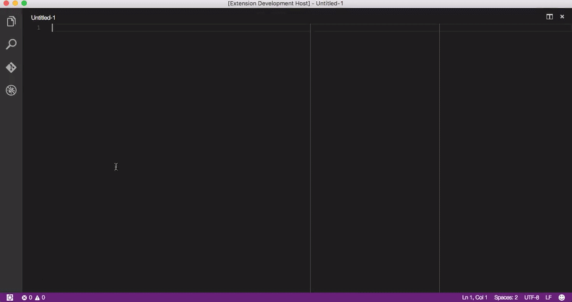

# vscode-apielements

VSCode extensions for API Elements.

### This is a work in progress.

#### Ideas

1. Syntax highlight (better one)
2. Provide parser error and warnings
3. Provide contextual symbols navigation (can be hard, but appealing)
4. Provide parser output
5. Render the document using `aglio`
6. Login with Apiary account to use some features on the IDE directly
7. Provide autocomplete (if I type `+ Request [` I want to see Http verbs, or in payloads I want to recall MSON structures) 
8. Select the best parser (shipped drafterjs or local drafterjs/protagonist)
9. Use Codelens feature to provide MSON references and Dredd test status for endpoint
